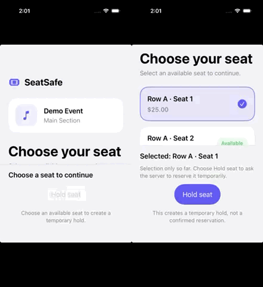

# SeatSafe

SeatSafe is a native iOS event-seat reservation application and a production-style quality engineering portfolio project. Its central engineering challenge is preserving correct reservation behavior under concurrency, retries, expired holds, network failures, and offline access.

## Current status

**Phase 1: reservation-core vertical slice complete.** The FastAPI service includes
configuration, demo identity injection, correlation IDs, Problem Details responses, the
PostgreSQL schema migrations, deterministic demo seeding,
`GET /v1/events/{event_id}/seats`, `POST /v1/holds`, and
`POST /v1/reservations` with database-backed idempotency. PostgreSQL tests cover
competing hold requests, hold and confirmation same-key replay, different-key
confirmation attempts, and transaction rollback after a real database constraint
failure. Hold creation's idempotency extension is recorded in ADR-014. Phase 2 is complete:
ADR-002 accepts Swift structured concurrency,
ADR-012 sets the iOS 17 deployment target, and ADR-013 selects lightweight SwiftUI feature
models with injected async services. The client can load the seat snapshot and locally
select one available seat, create a server hold, and safely retry an uncertain hold request
using the persisted seat/key pair described by ADR-015. Reservation confirmation now
continues that same flow: the client saves a confirmation key before calling the
reservation endpoint and safely retries the same hold/key after an uncertain response,
including after app-model recreation (ADR-016).
The client also ignores stale seat responses, returns a cancelled current load to a neutral
state, preserves retry information when hold/confirmation tasks are cancelled, and
suppresses duplicate in-flight hold and confirmation actions. Twenty-one deterministic iOS
unit tests validate the client behavior.

**Phase 3: UI automation and testability complete.** The shared Xcode scheme covers four
critical UI journeys: successful reservation, stale-seat conflict, hold expiration, and
API-unavailable/retry. The local runner uses a disposable PostgreSQL database and the real
API, and cleans up its temporary services. The final runner passed twice consecutively;
each run passed 21 iOS unit tests and all four UI journeys. See the
[Phase 3 evidence](docs/evidence/phase-3-ui-smoke.md) for commands, results, and limits.

**Phase 4: CI and release signals not started.** GitHub Actions, scheduled regression runs,
and CI artifact retention remain future work.

## Why this project exists

The visible application is intentionally small. The engineering depth comes from owning both the system and its quality infrastructure:

- Native Swift/SwiftUI client
- Swift structured concurrency, cancellation, and UI-state isolation
- XCTest and XCUITest automation
- Python/FastAPI service
- PostgreSQL persistence and transaction guarantees
- API, integration, concurrency, accessibility, and performance testing
- Continuous integration, failure artifacts, quality gates, and flake analysis
- Architecture Decision Records and defect case studies

## Core user journey

```text
Discover event -> inspect event -> select seat -> hold seat
    -> confirm reservation -> retrieve it online or offline -> cancel
```

## Demo — Phase 3 complete

The side-by-side simulator demo focuses on the concurrency conflict: one client gets the
temporary hold, and the other sees that the seat is no longer available. The idle interval
is removed, and the happy path is intentionally left out for now. These are manually driven
demo recordings; automated coverage for the conflict, confirmation, expiration, and
API-unavailable journeys is described in the [Phase 3 evidence](docs/evidence/phase-3-ui-smoke.md).



## Documentation

- [Product brief](docs/product-brief.md)
- [Engineering requirements](docs/engineering-requirements.md)
- [Test strategy](docs/test-strategy.md)
- [Learning plan](docs/learning-plan.md)
- [Roadmap](docs/roadmap.md)
- [Phase 2 concurrency evidence](docs/evidence/phase-2-concurrency.md)
- [Phase 3 UI smoke evidence](docs/evidence/phase-3-ui-smoke.md)
- [Interview project defense](docs/interview-project-defense.md)
- [Editable Excalidraw visual learning pack](docs/diagrams/README.md)
- [ADR-001: Own the reservation backend](docs/decisions/001-own-the-reservation-backend.md)
- [ADR-002: Manage client work with structured concurrency](docs/decisions/002-swift-structured-concurrency.md)
- [ADR-003: Serialize seat transitions with row locks and constraints](docs/decisions/003-serialize-seat-transitions-with-row-locks.md)
- [ADR-004: Use disposable PostgreSQL test environments](docs/decisions/004-use-disposable-postgresql-test-environments.md)
- [ADR-005: Use thin routes, application services, and repositories](docs/decisions/005-use-thin-routes-services-and-repositories.md)
- [ADR-006: Model holds and reservations as separate records](docs/decisions/006-normalize-holds-and-reservations.md)
- [ADR-007: Use database-backed idempotency](docs/decisions/007-use-database-backed-idempotency.md)
- [ADR-008: Inject a server-configured demo user in Phase 1](docs/decisions/008-inject-a-configured-demo-user.md)
- [ADR-009: Standardize API errors with Problem Details](docs/decisions/009-standardize-api-problem-details.md)
- [ADR-010: Use Docker Desktop for local containers](docs/decisions/010-use-docker-desktop-for-local-containers.md)
- [ADR-011: Return one event-seat availability snapshot](docs/decisions/011-return-an-event-seat-availability-snapshot.md)
- [ADR-012: Set the minimum iOS deployment target to iOS 17](docs/decisions/012-set-ios-deployment-target.md)
- [ADR-013: Use lightweight SwiftUI feature models](docs/decisions/013-use-lightweight-swiftui-feature-models.md)
- [ADR-014: Use database-backed idempotency for hold creation](docs/decisions/014-use-idempotency-for-hold-creation.md)
- [ADR-015: Persist pending hold attempts locally](docs/decisions/015-persist-pending-hold-attempt-locally.md)
- [ADR-016: Persist the hold and confirmation key locally](docs/decisions/016-persist-pending-confirmation-locally.md)
- [ADR-017: Run UI smoke tests against a disposable backend](docs/decisions/017-use-disposable-backend-for-ui-smoke-tests.md)

## Planned repository shape

The implementation structure follows accepted ADRs and will evolve as features are added:

```text
ios/                 Native application and Apple-platform tests
backend/             FastAPI service and backend tests
performance/         Load and contention scenarios
infrastructure/      Local environment and CI support
docs/                Requirements, decisions, strategy, and evidence
```

## Working agreement

This is a learning-first project. Major decisions are discussed, compared, recorded, and validated before implementation. See [AGENTS.md](AGENTS.md) for the collaboration rules applied to future Codex tasks.

## Current implementation slice

The client architecture is set by ADR-013. Seat loading, local selection, hold creation,
reservation confirmation, and stable-key recovery for both writes are implemented. Phase 2
and Phase 3 are complete; Phase 3's real-backend UI coverage includes the reservation,
conflict, expiration, and API-unavailable journeys. Phase 4 has not started.
The database permits only one active hold per event-seat, so the seat row lock remains
necessary even with idempotency: different customers use different keys while competing
for the same seat.
